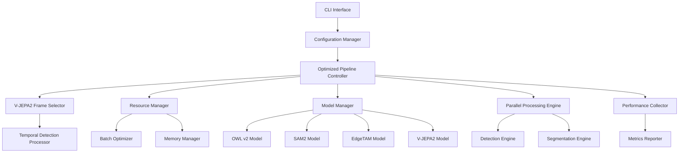

# Design Document

## Overview

This design document outlines the comprehensive optimization of SOWLv2 with EdgeTAM integration. The system will enhance the existing pipeline with intelligent performance optimizations, memory management, and provide EdgeTAM as a faster alternative to SAM2 for segmentation tasks. The design builds upon the existing optimization infrastructure while adding significant new capabilities for resource management, benchmarking, and user control.

## Architecture

### High-Level Architecture



### Core Components

#### 1. Enhanced Pipeline Controller
- Orchestrates the entire processing workflow
- Manages model selection (SAM2 vs EdgeTAM)
- Coordinates resource allocation and optimization
- Handles error recovery and fallback mechanisms

#### 2. EdgeTAM Integration Module
- Provides EdgeTAM model wrapper with SAM2-compatible interface
- Handles model downloading and initialization
- Implements both single-frame and video tracking modes
- Manages EdgeTAM-specific optimizations

#### 3. Advanced Resource Manager
- Monitors GPU memory usage in real-time
- Implements intelligent model caching with LRU eviction
- Provides streaming processing for large videos
- Manages automatic fallback to CPU when needed

#### 4. Enhanced V-JEPA2 Optimizer
- Improved motion-aware importance scoring
- Temporal detection merging across frames
- Adaptive frame selection based on content analysis
- Batch processing optimization for similar content

#### 5. Performance Monitoring System
- Real-time performance metrics collection
- Comparative benchmarking (SAM2 vs EdgeTAM)
- Memory usage tracking and reporting
- Processing time analysis per pipeline stage

## Components and Interfaces

### EdgeTAM Integration

#### EdgeTAMWrapper Class
```python
class EdgeTAMWrapper:
    def __init__(self, model_name: str, device: str)
    def segment(self, pil_image: Image.Image, box_xyxy: List[float]) -> np.ndarray
    def init_state(self, frames_dir: str) -> Any
    def add_new_box(self, state: Any, frame_idx: int, box: List[float], obj_idx: int)
    def propagate_in_video(self, state: Any) -> Iterator
    def get_performance_metrics(self) -> Dict[str, float]
```

#### Model Factory
```python
class SegmentationModelFactory:
    @staticmethod
    def create_model(model_type: str, model_name: str, device: str) -> Union[SAM2Wrapper, EdgeTAMWrapper]
    @staticmethod
    def get_available_models() -> Dict[str, List[str]]
```

### Enhanced Resource Management

#### AdvancedResourceManager Class
```python
class AdvancedResourceManager:
    def __init__(self, device: str, memory_limit: Optional[float])
    def monitor_memory_usage(self) -> MemoryStats
    def optimize_batch_sizes(self, current_usage: float) -> BatchConfig
    def enable_streaming_mode(self, video_size: int) -> StreamingConfig
    def cleanup_resources(self, force: bool = False)
    def get_optimal_device_allocation(self) -> DeviceAllocation
```

#### IntelligentModelCache (Enhanced)
```python
class IntelligentModelCache:
    def load_model_with_priority(self, model_name: str, priority: int) -> Any
    def preload_models_for_batch(self, model_list: List[str])
    def implement_lru_eviction(self, memory_threshold: float)
    def get_cache_statistics(self) -> CacheStats
```

### Performance Monitoring

#### PerformanceCollector Class
```python
class PerformanceCollector:
    def start_timing(self, operation: str) -> str
    def end_timing(self, timer_id: str)
    def record_memory_usage(self, stage: str)
    def record_gpu_utilization(self, stage: str)
    def compare_models(self, sam2_metrics: Dict, edgetam_metrics: Dict) -> ComparisonReport
    def generate_report(self) -> PerformanceReport
```

#### BenchmarkRunner Class
```python
class BenchmarkRunner:
    def run_comparative_benchmark(self, test_data: List[str]) -> BenchmarkResults
    def profile_memory_usage(self, pipeline_config: PipelineConfig) -> MemoryProfile
    def measure_throughput(self, batch_sizes: List[int]) -> ThroughputResults
```

### Enhanced V-JEPA2 Integration

#### AdvancedVJepa2Optimizer Class
```python
class AdvancedVJepa2Optimizer(VJepa2VideoOptimizer):
    def get_adaptive_importance_scores(self, frames: List[Image.Image], content_type: str) -> List[float]
    def predict_optimal_detection_intervals(self, video_features: torch.Tensor) -> List[int]
    def batch_process_similar_content(self, video_batches: List[List[Image.Image]]) -> List[torch.Tensor]
    def optimize_for_content_type(self, content_analysis: ContentAnalysis) -> OptimizationConfig
```

## Data Models

### Configuration Models

```python
@dataclass
class EdgeTAMConfig:
    model_name: str = "facebook/edgetam-base"
    enable_video_tracking: bool = True
    optimization_level: int = 1
    memory_efficient_mode: bool = False

@dataclass
class OptimizationConfig:
    enable_mixed_precision: bool = True
    use_gradient_checkpointing: bool = False
    streaming_chunk_size: int = 100
    memory_limit_gb: Optional[float] = None
    optimization_level: int = 1

@dataclass
class BenchmarkConfig:
    enable_benchmarking: bool = False
    collect_memory_stats: bool = True
    compare_models: bool = False
    output_format: str = "json"
```

### Performance Models

```python
@dataclass
class PerformanceMetrics:
    processing_time: float
    memory_peak_usage: float
    gpu_utilization: float
    throughput_fps: float
    model_loading_time: float

@dataclass
class ComparisonReport:
    sam2_metrics: PerformanceMetrics
    edgetam_metrics: PerformanceMetrics
    speed_improvement: float
    memory_savings: float
    quality_comparison: Optional[Dict[str, float]]

@dataclass
class MemoryStats:
    total_memory: float
    allocated_memory: float
    cached_memory: float
    free_memory: float
    utilization_percentage: float
```

### Enhanced Pipeline Models

```python
@dataclass
class StreamingConfig:
    chunk_size: int
    overlap_frames: int
    enable_progressive_loading: bool
    memory_threshold: float

@dataclass
class DeviceAllocation:
    primary_device: str
    fallback_device: str
    model_device_mapping: Dict[str, str]
    memory_allocation: Dict[str, float]
```

## Error Handling

### Graceful Degradation Strategy

1. **EdgeTAM Fallback**: If EdgeTAM fails to load or process, automatically fallback to SAM2
2. **Memory Management**: Automatic batch size reduction and model unloading on memory pressure
3. **V-JEPA2 Fallback**: Use uniform frame sampling if V-JEPA2 processing fails
4. **Device Fallback**: Automatic CPU processing when GPU resources are exhausted
5. **Streaming Mode**: Automatic activation for large videos that exceed memory limits

### Error Recovery Mechanisms

```python
class ErrorRecoveryManager:
    def handle_model_loading_error(self, model_name: str, error: Exception) -> str
    def handle_memory_overflow(self, current_config: BatchConfig) -> BatchConfig
    def handle_processing_failure(self, stage: str, error: Exception) -> bool
    def implement_retry_logic(self, operation: Callable, max_retries: int = 3) -> Any
```

### Comprehensive Error Logging

```python
class EnhancedErrorLogger:
    def log_performance_context(self, error: Exception, context: Dict[str, Any])
    def log_resource_state(self, error: Exception)
    def generate_debugging_report(self, error_history: List[Exception]) -> str
```

## Testing Strategy

### Unit Testing

1. **EdgeTAM Integration Tests**
   - Model loading and initialization
   - Segmentation accuracy comparison with SAM2
   - Video tracking functionality
   - Performance metrics collection

2. **Resource Management Tests**
   - Memory monitoring accuracy
   - Batch size optimization logic
   - Model caching and eviction
   - Streaming mode activation

3. **V-JEPA2 Enhancement Tests**
   - Frame selection algorithms
   - Temporal detection merging
   - Motion-aware scoring
   - Batch processing efficiency

### Integration Testing

1. **End-to-End Pipeline Tests**
   - Complete video processing workflows
   - Model switching (SAM2 ↔ EdgeTAM)
   - Error recovery scenarios
   - Performance benchmarking

2. **Resource Stress Tests**
   - Large video processing
   - Memory limit scenarios
   - GPU utilization optimization
   - Concurrent processing

### Performance Testing

1. **Benchmark Validation**
   - Processing time measurements
   - Memory usage profiling
   - Throughput analysis
   - Quality assessment

2. **Comparative Analysis**
   - SAM2 vs EdgeTAM performance
   - Optimization effectiveness
   - Resource utilization efficiency
   - Scalability testing

## Implementation Phases

### Phase 1: EdgeTAM Integration Foundation
- Implement EdgeTAMWrapper with SAM2-compatible interface
- Create model factory for dynamic model selection
- Add basic CLI support for EdgeTAM selection
- Implement fallback mechanisms

### Phase 2: Advanced Resource Management
- Enhance memory monitoring and management
- Implement intelligent model caching with LRU
- Add streaming processing for large videos
- Create adaptive batch size optimization

### Phase 3: V-JEPA2 Enhancements
- Improve motion-aware importance scoring
- Implement temporal detection merging
- Add content-aware optimization
- Enhance batch processing for similar content

### Phase 4: Performance Monitoring System
- Implement comprehensive performance collection
- Add comparative benchmarking capabilities
- Create detailed reporting system
- Add real-time monitoring dashboard

### Phase 5: CLI and Configuration Enhancements
- Add all new CLI options and flags
- Implement YAML configuration support
- Create help system and documentation
- Add validation and error checking

### Phase 6: Testing and Optimization
- Comprehensive testing suite
- Performance optimization and tuning
- Documentation and examples
- User feedback integration

## Security Considerations

1. **Model Download Security**: Verify model checksums and use secure download channels
2. **Memory Safety**: Prevent buffer overflows in image processing
3. **Resource Limits**: Enforce memory and processing limits to prevent system overload
4. **Input Validation**: Validate all user inputs and configuration parameters
5. **Error Information**: Avoid exposing sensitive system information in error messages

## Scalability Considerations

1. **Multi-GPU Support**: Design for future multi-GPU processing
2. **Distributed Processing**: Architecture supports future distributed computing
3. **Cloud Integration**: Compatible with cloud-based processing services
4. **Batch Processing**: Efficient handling of large video collections
5. **Memory Efficiency**: Scalable memory management for various hardware configurations