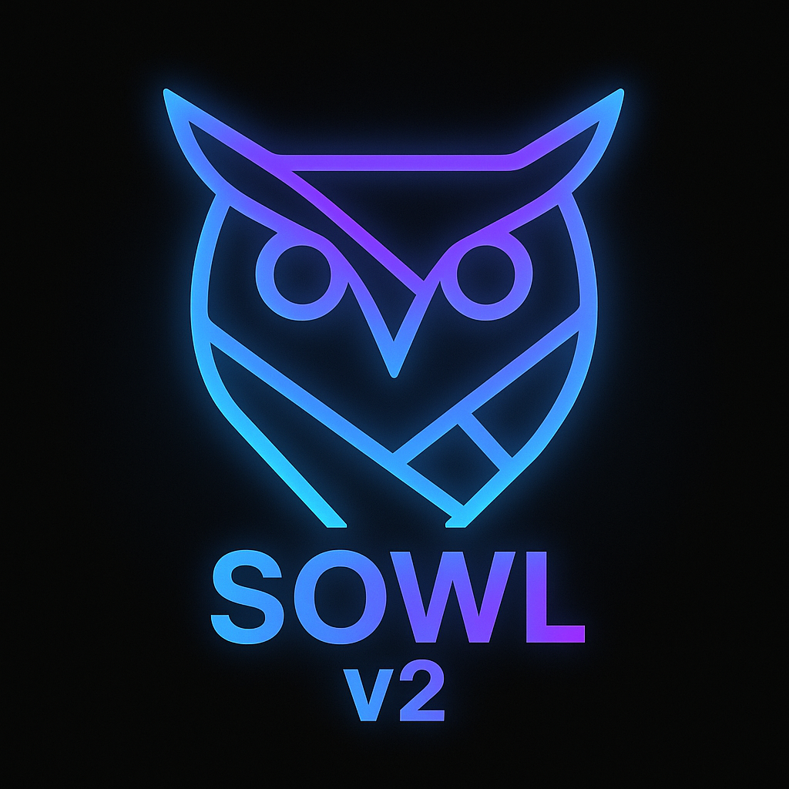

<!-- # SOWLv2

TL;DR: SOWLv2: Text-prompted object segmentation using OWLv2 and SAM 2 -->

<p align="center">
  
  <h1 align="center">SOWLv2: Text-Prompted Object Segmentation from video</h2>
  <div align="center">
    <a href="https://colab.research.google.com/drive/1vX6P4KNmWoisY-Vfq6bAVunsHaLrC-AO">
      
    </a>
    <a href="https://github.com/bladeszasza/SOWLv2/blob/main/LICENSE">
        
    </a>
    <a href="https://github.com/bladeszasza/SOWLv2/actions/workflows/pylint.yml">
        
    </a>
    <a href="https://github.com/bladeszasza/SOWLv2/actions/workflows/github-code-scanning/codeql">
        
    </a>
    <!-- <a href="LINK_TO_PYPI"></a> -->
  </div>
  <br>
</p>

SOWLv2 (**S**egmented**OWLv2**) is a powerful command-line tool for **text-prompted object segmentation**. It seamlessly integrates Google's [OWLv2](https://huggingface.co/docs/transformers/en/model_doc/owlv2) open-vocabulary object detector with Meta's [SAM 2](https://github.com/facebookresearch/sam2) (Segment Anything Model V2) to precisely segment objects in images, image sequences (frames), or videos based on natural language descriptions.

Given one or more text prompts (e.g., `"a red bicycle"`, or `"cat" "dog"`) and an input source, SOWLv2 will:
1.  Utilize **OWLv2** to detect bounding boxes for objects matching the text prompt(s), based on the principles from the paper [Scaling Open-Vocabulary Object Detection](https://arxiv.org/abs/2306.09683).
2.  Employ **SAM 2** to generate detailed segmentation masks for each detected object, leveraging techniques from the paper [SAM 2: Segment Anything in Images and Videos](https://arxiv.org/abs/2408.00714).
3.  Save both **binary segmentation masks** (foreground vs. background) and **overlay images** (original image with masks visually overlaid) to a specified output directory.


## ✨ Key Features

*   **Text-Prompted Segmentation:** Identify and segment objects using free-form text descriptions.
*   **Multi-Object Detection:** Supports providing multiple text prompts simultaneously to detect different classes of objects in a single run.
*   **State-of-the-Art Models:** Leverages the power of Google's OWLv2 and Meta's SAM 2.
*   **Versatile Input:** Supports single images, directories of frames, and video files.
*   **Comprehensive Output:** Generates both binary masks for programmatic use and visual overlays for inspection.
*   **Customizable:** Allows selection of specific OWLv2 and SAM 2 model variants, detection thresholds, and video processing parameters.
*   **Easy Installation:** Installable via pip directly from the Git repository.
*   **GPU Acceleration:** Automatically utilizes CUDA-enabled GPUs if available, with a fallback to CPU.

## 🚀 Quick Start & Demo

Explore SOWLv2's capabilities interactively with our Google Colab Notebook:

[](https://colab.research.google.com/drive/1vX6P4KNmWoisY-Vfq6bAVunsHaLrC-AO)

The notebook provides a step-by-step demonstration for all supported input types (images, frames, videos), including examples with multiple prompts.

## 🛠️ Installation

SOWLv2 can be installed directly from this Git repository using pip. Ensure you have Python 3.10+ and pip installed.

```bash
pip install git+https://github.com/bladeszasza/SOWLv2.git
```

This command will also install all necessary dependencies, including `transformers`, `sam2`, `opencv-python`, `torch`, and others.

Alternatively, you can clone the repository and install using `setup.py` or `requirements.txt`:
```bash
git clone https://github.com/bladeszasza/SOWLv2.git
cd SOWLv2
pip install -r requirements.txt
# or
# python setup.py install```

## ⚙️ Usage

Once installed, the `sowlv2-detect` command-line tool will be available.

### Basic Command Structure:

To detect a single type of object:
```bash
sowlv2-detect --prompt "your text prompt" --input <path_to_input> --output <path_to_output_dir> [options]
```

To detect multiple types of objects in one go:
```bash
sowlv2-detect --prompt "prompt one" "prompt two" "another object" --input <path_to_input> --output <path_to_output_dir> [options]
```
Note: If a single prompt contains spaces, it should be enclosed in quotes (e.g., `"a red bicycle"`). When providing multiple prompts, each prompt is a separate string.

### Command-Line Options:

/
| `--prompt`      | **(Required)** One or more text queries for object detection (e.g., `"cat"`, or `"dog" "person" "a red car"`).                       | `None`                               |
| `--input`       | **(Required)** Path to the input: a single image file, a directory of image frames, or a video file.                                | `None`                               |
| `--output`      | Directory where outputs (masks and overlays) will be saved. Created if it doesn't exist.                                           | `output/`                            |
| `--owl-model`   | (Optional) OWLv2 model name from Hugging Face Model Hub.                                                                           | `google/owlv2-base-patch16-ensemble` |
| `--sam-model`   | (Optional) SAM 2 model name from Hugging Face Model Hub.                                                                           | `facebook/sam2.1-hiera-small`        |
| `--threshold`   | (Optional) Detection confidence threshold for OWLv2 (a float between 0 and 1).                                                     | `0.1`                                |
| `--fps`         | (Optional) Frame sampling rate (frames per second) for video inputs.                                                               | `24`                                 |
| `--device`      | (Optional) Compute device (`"cuda"` or `"cpu"`).                                                                                     | Auto-detects GPU, else `cpu`         |
| `--no-merged`   | (Optional) Disables merged mode. Merged mode (where all masks are combined into a single output [image/video] ) is enabled by default.                   | Enabled                              |
| `--no-binary`   | (Optional) Disables binary mask generation. Binary mask output is enabled by default.                                                  | Enabled                              |
| `--no-overlay`  | (Optional) Disables overlay image generation. Overlay image output (original image with masks) is enabled by default.                  | Enabled                              |
| `--config`      | (Optional) Path to a YAML configuration file to specify arguments (see [Configuration](#configuration)). Prompts can also be a list in YAML. | `None`                               |

### Examples:

1.  **Segment "dogs" in a single image:**
    ```bash
    sowlv2-detect --prompt "dog" --input path/to/your/dog_image.jpg --output results/dog_segmentation/
    ```

2.  **Segment "cat" and "duck" in a folder of image frames:**
    ```bash
    sowlv2-detect --prompt "cat" "duck" --input path/to/your/frames_folder/ --output results/person_bike_frames_segmentation/
    ```

3.  **Segment "car" (potentially a specific type like "a red car") in a video, sampling at 10 FPS:**
    ```bash
    sowlv2-detect --prompt "a red car" --input path/to/your/video.mp4 --output results/red_car_video_segmentation/ --fps 10
    ```

4.  **Using larger models to detect "cats" and "dogs" for potentially higher accuracy (requires more GPU VRAM):**
    ```bash
    sowlv2-detect --prompt "cat" "dog" --input image_with_pets.jpg --output results_pets_large/ \
                  --owl-model "google/owlv2-large-patch14-ensemble" \
                  --sam-model "facebook/sam2.1-hiera-large"
    ```

### Output Structure:

The tool saves results in the specified output directory with the following structure:

```
output_dir/
├── binary/                  # Binary mask images/videos
│   ├── merged/             # Merged binary masks (all objects combined)
│   │   ├── 000001_merged_mask.png
│   │   ├── 000002_merged_mask.png
│   │   └── ...
│   └── frames/             # Individual binary masks per object
│       ├── 000001_obj1_cat_mask.png
│       ├── 000001_obj2_dog_mask.png
│       ├── 000002_obj1_cat_mask.png
│       └── ...
├── overlay/                # RGB overlay images/videos
│   ├── merged/            # Merged overlays (all objects combined)
│   │   ├── 000001_merged_overlay.png
│   │   ├── 000002_merged_overlay.png
│   │   └── ...
│   └── frames/            # Individual overlays per object
│       ├── 000001_obj1_cat_overlay.png
│       ├── 000001_obj2_dog_overlay.png
│       ├── 000002_obj1_cat_overlay.png
│       └── ...
└── video/                 # Generated videos (for video input)
    ├── binary/            # Binary mask videos
    │   ├── merged_mask.mp4     # Merged binary mask video
    │   ├── obj1_cat_mask.mp4   # Individual object videos
    │   └── obj2_dog_mask.mp4
    └── overlay/           # Overlay videos
        ├── merged_overlay.mp4  # Merged overlay video
        ├── obj1_cat_overlay.mp4
        └── obj2_dog_overlay.mp4
```

#### File Naming Convention:

For each detected object instance, SOWLv2 generates files using the following patterns:

**Individual Object Files:**
*   **Binary masks**: `{frame_num}_obj{obj_id}_{prompt}_mask.png` (e.g., `000001_obj1_cat_mask.png`)
*   **Overlay images**: `{frame_num}_obj{obj_id}_{prompt}_overlay.png` (e.g., `000001_obj1_cat_overlay.png`)

**Merged Files (all objects combined):**
*   **Binary masks**: `{frame_num}_merged_mask.png` (e.g., `000001_merged_mask.png`)
*   **Overlay images**: `{frame_num}_merged_overlay.png` (e.g., `000001_merged_overlay.png`)

**Video Files:**
*   **Individual object videos**: `obj{obj_id}_{prompt}_mask.mp4` / `obj{obj_id}_{prompt}_overlay.mp4`
*   **Merged videos**: `merged_mask.mp4` / `merged_overlay.mp4`

Objects are numbered sequentially (`obj1`, `obj2`, etc.) in the order they are detected by OWLv2, regardless of which text prompt they matched. Frame numbers use 6-digit zero-padding (`000001`, `000002`, etc.).

SOWLv2 automatically assigns a unique color to each detected object class, making it easy to visually distinguish different object types in the output overlays and merged results.

### <a name="configuration"></a>Configuration File (Optional):

You can use a YAML configuration file to specify arguments, which is useful for managing complex settings or reproducing experiments. The `prompt` field in the YAML file can also be a list of strings.

Example `config.yaml` with multiple prompts:
```yaml
prompt:
  - "a pedestrian crossing the street"
  - "traffic light"
  - "bus"
input: "data/street_scene.mp4"
output: "results/street_multi_object_video"
owl-model: "google/owlv2-base-patch16-ensemble"
sam-model: "facebook/sam2.1-hiera-small"
threshold: 0.15
fps: 15
device: "cuda"
```

Run with config:
```bash
sowlv2-detect --config config.yaml
```
Note: Command-line arguments will override values specified in the config file if both are provided. If `--prompt` is given on the command line, it will override the `prompt` list in the config file.

## 🧠 How It Works

SOWLv2 follows a two-stage pipeline:

1.  **OWLv2 Detection:**
    The input image/frame is processed using the specified OWLv2 model (default: `google/owlv2-base-patch16-ensemble`) via the Hugging Face `transformers` library. Based on the provided text prompt(s), OWLv2 identifies relevant objects and outputs their bounding boxes along with confidence scores and the specific prompt that matched each detection.

2.  **SAM 2 Segmentation:**
    For each bounding box detected by OWLv2 (above the specified confidence threshold), the SAM 2 model (default: `facebook/sam2.1-hiera-small`) is invoked. SAM 2 takes the original image and the bounding box as input prompts to generate a precise segmentation mask for the object within that box. For videos, SAM 2's video-specific capabilities are used to propagate masks across frames.

3.  **Output Generation:**
    The generated binary masks are saved as grayscale PNG files. Additionally, these masks are overlaid onto the original images/frames to create visually inspectable results, which are also saved. For video inputs, individual frame outputs are processed, and then compiled into per-object mask videos and overlay videos.

## 📦 Dependencies

SOWLv2 relies on the following major Python packages:
*   `torch` (PyTorch)
*   `transformers` (for OWLv2 models)
*   `sam2` (Meta's SAM 2 package)
*   `opencv-python` (for image and video processing)
*   `numpy`, `Pillow`, `pyyaml`, `huggingface_hub`

These dependencies are listed in `setup.py` and `requirements.txt` and will be installed automatically when using pip.

## 📜 License

This project is licensed under the Apache 2.0 License.
See the `LICENSE` file for more details.

## 🤝 Contributing

Contributions are welcome! If you'd like to contribute, please feel free to fork the repository, make your changes, and submit a pull request. For major changes or new features, please open an issue first to discuss what you would like to change.

## 🙏 Acknowledgments

SOWLv2 builds upon the incredible work of researchers and developers behind these foundational models and libraries:
*   **OWLv2:** [Google Research](https://huggingface.co/docs/transformers/en/model_doc/owlv2)
    *   Paper: [Scaling Open-Vocabulary Object Detection](https://arxiv.org/abs/2306.09683)
*   **SAM 2:** [Meta AI Research](https://github.com/facebookresearch/sam2)
    *   Paper: [SAM 2: Segment Anything in Images and Videos](https://arxiv.org/abs/2408.00714)

We extend our sincere gratitude to the authors and maintainers for open-sourcing their code and models.

---
### 🌟 Developed by Csaba Bolyòs 🚀

Connect with me:
[🔗 LinkedIn](https://www.linkedin.com/in/csaba-boly%C3%B2s-00a11767/) | [📓 Google Colab Demo](https://colab.research.google.com/drive/1vX6P4KNmWoisY-Vfq6bAVunsHaLrC-AO)
