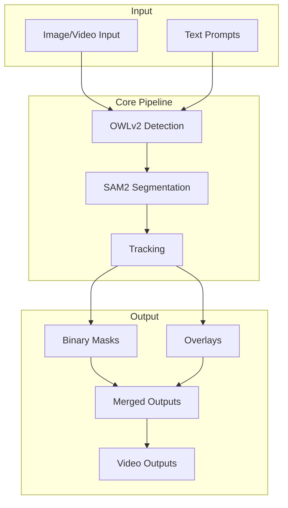
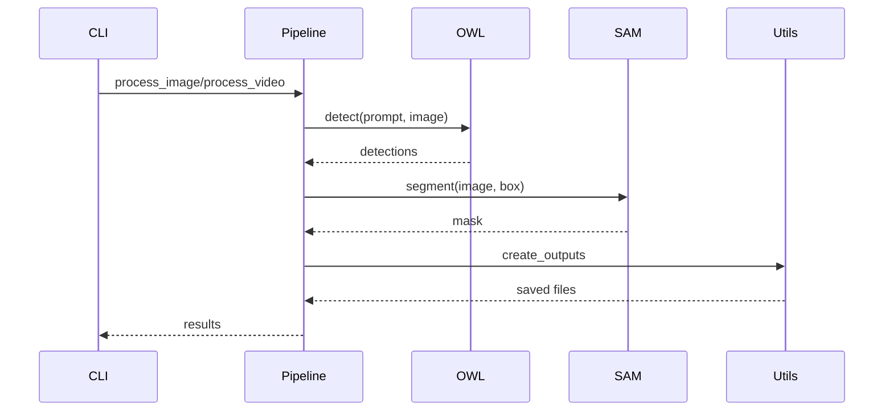
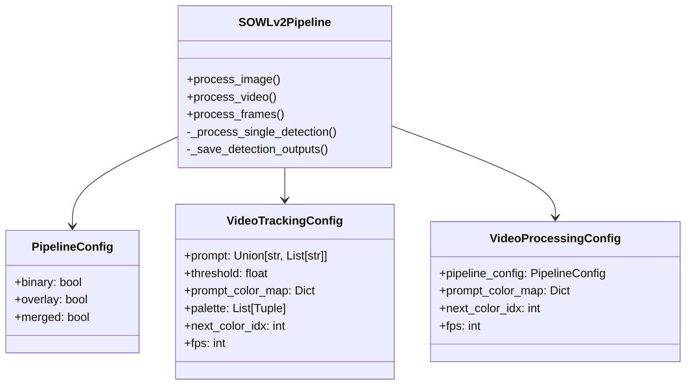
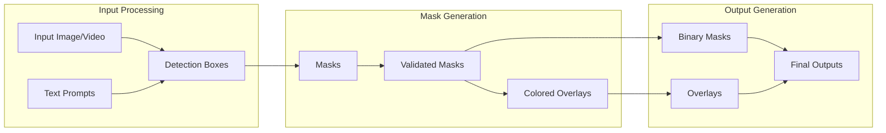
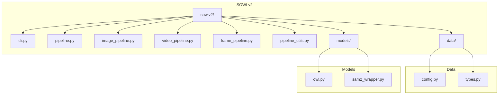
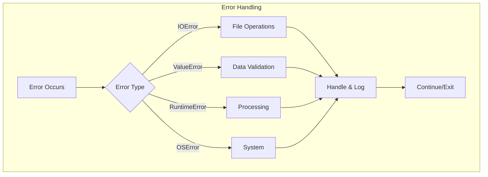
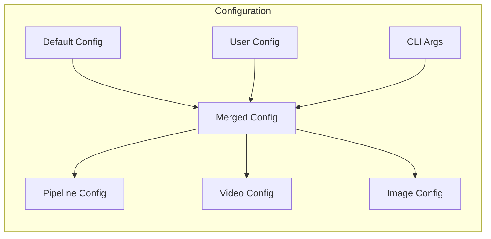

# SOWLv2 Architecture

## System Overview

## Component Interaction

## Class Structure

## Data Flow

## Directory Structure

## Error Handling Flow

## Configuration Flow

These diagrams provide a comprehensive view of the SOWLv2 architecture, including:

1. System overview and component interaction
2. Class structure and relationships
3. Data flow through the system
4. Directory structure
5. Error handling flow
6. Configuration management

Each diagram focuses on a different aspect of the system, making it easier to understand the overall architecture and how different components interact with each other.
